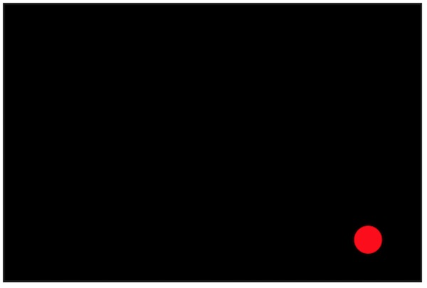
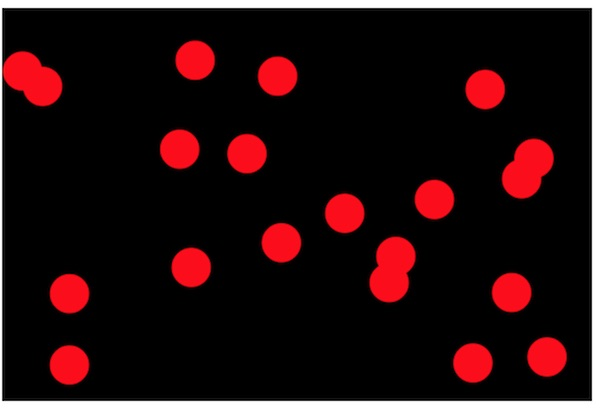
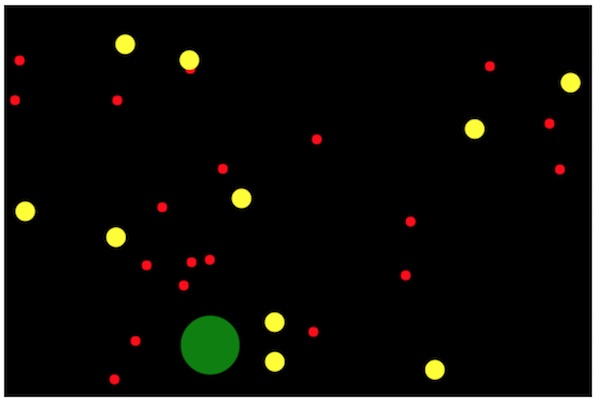

# 1 - Intro to Canvas Sprites

## Overview
Let's get stuff moving on the screen, and begin to explore the many techniques we have for creating objects in JavaScript.


## Contents
<!--- Local Navigation --->
I. [A Bouncing Circle!](#section1)

II. [Creating an Object Literal with a `draw()` method](#section2)

III. [A better Object literal](#section3)

IV. [Create multiple objects with a "factory function"](#section4)

V. [Review Exercise](#section5)


<hr>

## <a id="section1">I. A Bouncing Circle!

To get things going, you are actually going to have to create 4 files - but it will be worth it because we will be reusing these files throughout this entire series.

This first attempt is going to be less than optimal and NOT going to use an object to draw a sprite, but instead will utilize script scoped variables to hold the circle's state.

**canvas-sprites-intro-1.html**
```html
<!DOCTYPE html>
<html lang="en">
<head>
	<meta charset="utf-8" />
	<title>Intro to Canvas Sprites</title>
</head>
<body>
<canvas width="600" height="400"></canvas>
	<script src="js/utilities.js"></script>
	<script src="js/classes.js"></script>
	<script src="js/main.js"></script>
</body>
</html>
```

**js/utilities.js**

```javascript
"use strict";
function getRandomUnitVector(){
	let x = getRandom(-1,1);
	let y = getRandom(-1,1);
	let length = Math.sqrt(x*x + y*y);
	if(length == 0){ // very unlikely
		x=1; // point right
		y=0;
		length = 1;
	} else{
		x /= length;
		y /= length;
	}

	return {x:x, y:y};
}

function getRandom(min, max) {
	return Math.random() * (max - min) + min;
}
```

**js/classes.js**
```javascript
// empty for now
```

**js/main.js**
```javascript
"use strict";
// these variables are in "Script scope" and will be available in this and other .js files
const ctx = document.querySelector("canvas").getContext("2d");
const screenWidth = 600;
const screenHeight = 400;

let color = "red";
let radius = 20;
let x = Math.random() * (screenWidth - 100) + 50;
let y = Math.random() * (screenHeight - 100) + 50;
let fwd = getRandomUnitVector();
let speed = 2;

loop();


function loop(){
	// schedule a call to loop() in 1/60th of a second
	requestAnimationFrame(loop);
	
	// move circle
	x += fwd.x * speed;
	y += fwd.y * speed;
		
	// check sides and bounce
	if (x <= radius || x >= screenWidth-radius){
			fwd.x *= -1; 
	}
	
	if (y <= radius || y >= screenHeight-radius){
		fwd.y *= -1; 
	}
	
	// draw background
	ctx.fillRect(0,0,screenWidth,screenHeight)
	
	// draw circle
	ctx.save();
	ctx.beginPath();
	ctx.arc(x, y, radius, 0, Math.PI*2, false);
	ctx.closePath();
	ctx.fillStyle = color;
	ctx.fill();
	ctx.restore();
}
```

**Which gives us the following - a moving and bouncing red circle:**




## <a id="section2">II. Creating an Object Literal with a `draw()` method

**Note: If you need a refresher on JavaScript object literals, please read this tutorial page: [JavaScript Object Literals](web-apps-7.md)**

We are now going to simplify our code somewhat by transferring most of the circle moving and drawing code onto a single object literal. Go ahead and make the following changes:

**js/classes.js**
```javascript
"use strict";
function createSprites(){
	// create Object literal
	let s = { };
	
	// add properties
	s.radius = 20;
	s.color = "red";
	s.x = Math.random() * (screenWidth - 100) + 50;
	s.y = Math.random() * (screenHeight - 100) + 50;
	s.fwd = getRandomUnitVector();
	s.speed = 2;
	
	//add methods
	s.draw = function(ctx){
			ctx.save();
			ctx.beginPath();
			ctx.arc(this.x, this.y, this.radius, 0, Math.PI*2, false);
			ctx.closePath();
			ctx.fillStyle = this.color;
			ctx.fill();
			ctx.restore();
	};
	
	return [s]; // return our sole sprite in an array
}
```

**js/main.js**
```javascript
"use strict";
// these variables are in "Script scope" and will be available in this and other .js files
const ctx = document.querySelector("canvas").getContext("2d");
const screenWidth = 600;
const screenHeight = 400;
let sprites = []; // an array to hold all of our sprites


init();

function init(){
	sprites = createSprites();
	loop();
}

function loop(){
	// schedule a call to loop() in 1/60th of a second
	requestAnimationFrame(loop);
	
	// draw background
	ctx.fillRect(0,0,screenWidth,screenHeight)
	
	// loop through sprites
	for (let s of sprites){
	// move sprites
	// soon!
		
	// check sides and bounce
	// soon!
	
	// draw sprites
	s.draw(ctx);
		
	} // end for
} // end loop()
```

- Here we have moved much of the circle state and behavior into an object literal.
- If we run this example now we will see the red circle drawn on the screen, but it is not moving. We are also getting our *main.js* file ready to handle the drawing and moving of arrays of sprites.
- But first, in order to get this single circle moving again, you will need to add more code.


## <a id="section3">III. A better Object literal
	
Let's get our circle object moving and bouncing now:
	
**Add the following to classes.js:**

```javascript
// move
s.move = function(){
	this.x += this.fwd.x * this.speed;
	this.y += this.fwd.y * this.speed;
};

// bounce on left/right
s.reflectX = function(){
	this.fwd.x *= -1;
}

// bounce on top/bottom
s.reflectY = function(){
	this.fwd.y *= -1;
}
```

**Add the following to main.js:**

```javascript
// move sprites
s.move();

// check sides and bounce
if (s.x <= s.radius || s.x >= screenWidth-s.radius){
	s.reflectX();
	s.move();
}
if (s.y <= s.radius || s.y >= screenHeight-s.radius){
	s.reflectY();
	s.move();
}
```

- We should now be back to where we started this exercise, a single bouncing circle.


## <a id="section4">IV. Create multiple objects with a "factory function"
	
In this section we are going to modify our code to utilize a loop and create an array of multiple circle objects. We just need to add a few lines of code to main.js to get this to work - see below:

**classes.js**
```javascript
"use strict";
function createSprites(num=20){
	// create array to hold all of our sprites
	let sprites = []; // NEW
	for(let i=0;i<num;i++){ // NEW
		// create Object literal
		let s = { };
		
		/*
		All of this code is the same
		*/
		
		// bounce on top/bottom
		s.reflectY = function(){
			this.fwd.y *= -1;
		}
		
		// add to array
		sprites.push(s); // NEW
	} // NEW
	
	// return entire array
	return sprites; // NEW
}
```

**Which gives us the following - 20 moving and bouncing red circles:**




## V. <a id="section5">Review Exercise
1. Make a copy of your completed files from section IV. above, and name the HTML file **canvas-sprites-1-HW.html**
1. Modify `createSprites()` so that it will take `num`, `radius` and `color` arguments, and utilize these when creating the circle sprites in the `for` loop.
1. In *main.js* call `createSprites()` at least 3 times like this, and add the results to the `sprites` array in *main.js*:

```javascript
// create at least 3 different batches of circle sprites
let sprites1 = createSprites(20,5,"red");
let sprites2 = createSprites(10,10,"yellow");
let sprites3 = createSprites(1,30,"green");

// now concatenate the above arrays to the main.js `sprites` array
```


**The end result should look something like this:**



<hr><hr>

**[Table of Contents <- About this Canvas Sprites Tutorial Series](canvas-sprites-0.md)**

**[Next Chapter -> `Object.create()` & Delegation (chapter 2)](canvas-sprites-2.md)**
