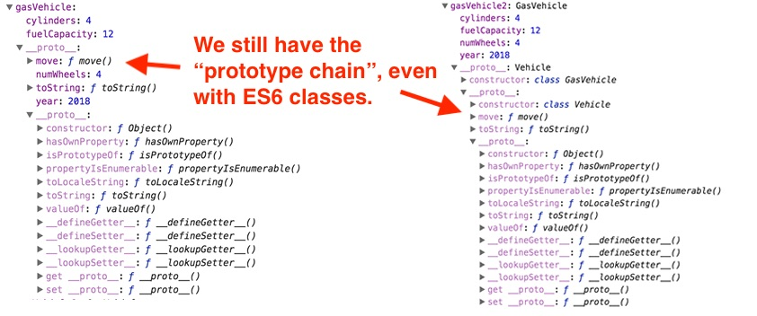

# 3 - Canvas & ES6 Classes

## Overview
In the last chapter we utilized **prototype-based inheritance** (and factory functions,  object literals and `Object.create()`) to create an inheritance-like hierarchy of sprite objects.

In this chapter we will utilize ES6 class syntax to more or less do the same thing.

**Note: If you need a refresher on JavaScript ES6 classes, please read the first 3 sections of his tutorial page: [ES6 Classes & PixiJS Animation](pixi-js-2.md)**

## Contents
<!--- Local Navigation --->
I. [What is the deal with ES6 classes?](#section1)

II. [A quick example](#section2)

III. [Discussion](#section3)

IV. [Review Exercise](#section4)

<hr>

## I. <a id="section1">What is the deal with ES6 classes?

From https://developer.mozilla.org/en-US/docs/Web/JavaScript/Reference/Classes

**JavaScript classes, introduced in ECMAScript 2015, are *primarily syntactical sugar* over JavaScript's existing prototype-based inheritance. The class syntax does not introduce a new object-oriented inheritance model to JavaScript.**

By "syntatical sugar" we mean that behind the scenes, ES6 class syntax merely re-creates what we manually did in the last section using prototypical inheritance and `Object.create()`

## II. <a id="section2">A quick example
	
Below we will create a "Vehicle" and a derived "Gas Vehicle" utilizing both prototypical inheritance, and ES6 classes. We will see that there is almost no difference between the objects that are created by the JavaScript engine.
 
**canvas-sprite-es6-classes-1.html**

```html
<!DOCTYPE html>
<html lang="en">
<head>
	<meta charset="utf-8" />
	<title>Canvas Sprites - ES6 Classes</title>
</head>
<body>
<script>
/* I. Object.create() - OLOO - Delegation */
// Our "base" object
let vehicle = {
  year: 2018,
  numWheels: 4,
  move(){
    console.log("Moving the vehicle now");
  },
  toString(){
  	return "Year: " + this.year + ", numWheels: " + this.numWheels;
  }
};

// gasVehicle's prototype is vehicle - i.e. gasVehicle's "superclass" is vehicle
// gasVehicle will be extending and overriding behavior defined in its prototype objects
let gasVehicle = Object.create(vehicle);
	
// add specialized properties to our derived object
gasVehicle.cylinders = 4;
gasVehicle.fuelCapacity = 12;

console.log("**** Object.create() - OLOO - Delegation ****");
console.log(gasVehicle.cylinders); 	// .cylinders is "own" property
gasVehicle.move(); 			// .move() is in gasVehicle's prototype (i.e. `vehicle`)
console.log(gasVehicle.toString()); 	// .toString() in vehicle shadows toString() in the default prototype object
console.log(gasVehicle.valueOf()); 	// .valueOf() is in the the default prototype object


/* II. ES6 classes and inheritance */
class Vehicle{
	constructor(year,numWheels){
		this.year = year;
		this.numWheels = numWheels;
	}
	
	move(){
    console.log("Moving the vehicle now");
  }
  
  toString(){
  	return "Year: " + this.year + ", numWheels: " + this.numWheels;
  }
}

class GasVehicle extends Vehicle{
	constructor(year,numWheels,cylinders,fuelCapacity){
		super(year,numWheels);
		this.cylinders = cylinders;
		this.fuelCapacity = fuelCapacity;
	}
}

let gasVehicle2 = new GasVehicle(2018,4,4,12);

console.log("**** ES6 Classes ****");
console.log(gasVehicle2.cylinders); 
gasVehicle2.move(); 									
console.log(gasVehicle2.toString()); 
console.log(gasVehicle2.valueOf()); 

debugger; // check the debugger, gasVehicle and gasVehicle2 are nearly identical!


</script>
</body>
</html>
```

### Which gives you this in the console - `gasVehicle` and `gasVehicle2` are nearly identical!

```javascript
**** Object.create() - OLOO - Delegation ****
4
Moving the vehicle now
Year: 2018, numWheels: 4
{cylinders: 4, fuelCapacity: 12}

**** ES6 Classes ****
4
Moving the vehicle now
Year: 2018, numWheels: 4
GasVehicle {year: 2018, numWheels: 4, cylinders: 4, fuelCapacity: 12}
```

### Which gives you this in the debugger - `gasVehicle` and `gasVehicle2` are nearly identical!




## III. <a id="section3">Discussion
	
Whether to use or not use ES6 classes is a controversial subject in the JS developer community:

- https://www.quora.com/Are-ES6-classes-bad-for-JavaScript
- https://github.com/joshburgess/not-awesome-es6-classes
	
## IV. <a id="section4">Review Exercise
- Duplicate *canvas-sprites-2-HW.html* and name it **canvas-sprites-3-HW.html**
- Convert the prototype-based inheritance model you originally used to instead utilize ES6 classes exclusively.
- Everything should work exactly as before.
- Be sure to delete any unnecessary code from your JavaScript files.
- Look over both versions carefully, and then answer these questions in the comments field of the dropbox:
    - Which version has more lines of code?
    - Which version do you think is easier to write, understand, and debug? 
    - Which approach (ES6 Classes or ES5 prototypical inheritance) do you think you will use in your personal JavaScript projects?
- Hints:
    - you should only have to change the code in *classes.js* - everything in the other 3 files should be exactly the same.
    - you will still need all of your *classes.js* factory functions, but they will have a lot less code in them.

<hr><hr>

**[Previous Chapter <- `Object.create()` & Delegation (chapter 2)](canvas-sprites-2.md)**

**[Next Chapter -> JavaScript & ES6 Modules (chapter 4)](canvas-sprites-4.md)**
  
 
