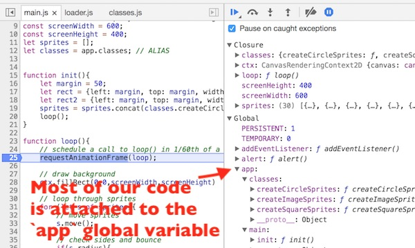

# 5 - JavaScript & the ES5 *Revealing Module Pattern*

## Overview
- In the last chapter we looked at how easy it is to utilize ES6 module syntax to create loosely coupled and highly maintainable code.
- The only issue with ES6 modules? They are supported only on recent versions of the major browsers.
- In this chapter, we will look at creating modular code using the *Revealing Module Pattern* - which is a popular technique for achieving modularity in pre-ES6 browsers. You can read about this pattern and others here: 
https://addyosmani.com/resources/essentialjsdesignpatterns/book/#revealingmodulepatternjavascript


## Contents
<!--- Local Navigation --->
I. [Back to ES5](#section1)

II. [The Revealing Module Pattern](#section2)

III. [Attaching modules to a global object](#section3)

IV. [Converting "Bouncing Sprites" to the ES5 module pattern](#section4)

V. [Discussion](#section5)

VI. [Review Questions](#section6)

<hr>

## I. <a id="section1">Back to ES5

- Below is an external JS file that has some helpful code and variables in it. Some of this code we would like to keep public and visible elsewhere, some of it we want to hide away so it doesn't get mutuated or overwritten by code wriiten elsewhere.
- But under ES5, all of this code is in either Script scope or Global scope, and thus vulnerable to being overwritten by code written elsewhere (it could also overwrite other code itself)

**myutils.js** (For illustrative purposes only, don't create this file)
```javascript
"use strict";

// public stuff
let someVariable = 42;

function getRandomUnitVector(){
	let x = getRandom(-1,1);
	let y = getRandom(-1,1);
	let length = Math.sqrt(x*x + y*y);
	if(length == 0){ // very unlikely
		x=1; // point right
		y=0;
	} else{
		x /= length;
		y /= length;
	}

	return {x:x, y:y};
}

// stuff we would like to be private, but it's still public!
let privateVariable = 3.1415;
let secretCode = "ifmmp xpsme";

function getRandom(min, max) {
	return Math.random() * (max - min) + min;
}

// test it - everything is visible, everywhere!
console.log(revealingModule.someVariable); // 42
console.log(revealingModule.getRandomUnitVector); // function(){..}
console.log(revealingModule.getRandomUnitVector()); // something like {x:0.9722,y:0.2341}
console.log(revealingModule.privateVariable); // 3.1415
console.log(revealingModule.secretCode); // "ifmmp xpsme"
console.log(revealingModule.getRandom); // function(){..}
```

## II. <a id="section2">The Revealing Module Pattern
  
The ES5 Module pattern provides a way of creating a mix of public and private methods and variables, protecting the code from leaking into the global or script scope and accidentally colliding with code in other files. With this pattern, only a public API is returned, keeping everything else private.

- Below we define 3 variables and 2 functions inside of a function, and then call the function immediately (with the `()` at the end)
- Functions and variables defined within a function are local (private) to that function and not visible from the outside
- From this function, we will return one variable and one function reference that we want to expose (make public) to the rest of our program.
- This way of calling an anonymous function is know as an "Immediately Invoked Function Expression" aka IIFE or "Iffy"

**js/myutils-es5-module.js**
```javascript
"use strict";

let revealingModule = (function(){
	console.log("myutils-es5-module.js module loaded");
	
	// A) public stuff
	let someVariable = 42;

	function getRandomUnitVector(){
		let x = getRandom(-1,1);
		let y = getRandom(-1,1);
		let length = Math.sqrt(x*x + y*y);
		if(length == 0){ // very unlikely
			x=1; // point right
			y=0;
		} else{
			x /= length;
			y /= length;
		}

		return {x:x, y:y};
	}

	// B) private stuff
	let privateVariable = 3.1415;
	let secretCode = "ifmmp xpsme";

	function getRandom(min, max) {
		return Math.random() * (max - min) + min;
	}

	// C) export a public interface to this module
	return{
		meaningOfLife: someVariable,
		getRandomUnitVector: getRandomUnitVector
	};
		
})(); // D) call the function immediately, which returns the interface above
```

Here's the code to try out our module - and verify that we have successfully hidden away some of the functions and variables.

**test-1.html**
```javascript
<!DOCTYPE html>
<html lang="en">
<head>
	<meta charset="utf-8" />
	<title>Test-1</title>
	<script src="js/myutils-es5-module.js"></script>
</head>
<body>

<script>
	console.log("** Page loaded **");
	// Test revealingModule - and we can only use what was returned from it
	console.log(revealingModule.meaningOfLife); // 42
	console.log(revealingModule.getRandomUnitVector); // function
	console.log(revealingModule.getRandomUnitVector()); // something like {x:0.9722,y:0.2341}
	console.log(revealingModule.someVariable); // undefined
	console.log(revealingModule.privateVariable); // undefined
	console.log(revealingModule.secretCode); // undefined
	console.log(revealingModule.getRandom); // undefined
</script>
</body>
</html>
```

When we load this in the browser, we can see the results:
- note that the module loads first, then the page
- only `meaningOfLife` and `getRandomUnitVector()` are visible, everything else is encapsulated and hidden from the outside - analagous to private members in languages like Java or C#

```javascript
myutils-es5-module.js module loaded
** Page loaded **
42
function(){....}
{x: 0.9152363302323804, y: -0.40291743549115044}
undefined
undefined
undefined
undefined
```

## III. <a id="section3">Attaching modules to a global object

### III-A. Creating the `utils` module
A common way to create ES5 JS applications that have multiple modules is to create a single global object, and to make each module a property of that object.

Here is our new version of **myutils-es5-module.js** - note how we are now assigning the returned varaible and function to a property of an object named `app`:

```javascript
"use strict";

// 1)  If there is an `app` object already, use it.
// If `app` is nil, create an empty object literal
var app = app || {};

// 2) add a `utils` property to `app`
app.utils = (function(){
	console.log("myutils-es5-module.js module loaded");
	
	// A) public stuff
	let someVariable = 42;

	function getRandomUnitVector(){
		let x = getRandom(-1,1);
		let y = getRandom(-1,1);
		let length = Math.sqrt(x*x + y*y);
		if(length == 0){ // very unlikely
			x=1; // point right
			y=0;
		} else{
			x /= length;
			y /= length;
		}

		return {x:x, y:y};
	}

	// B) private stuff
	let privateVariable = 3.1415;
	let secretCode = "ifmmp xpsme";

	function getRandom(min, max) {
		return Math.random() * (max - min) + min;
	}

// C) export a public interface to this module
	return{
		meaningOfLife: someVariable,
		getRandomUnitVector: getRandomUnitVector
	};
		
})(); // D) call the function immediately, which returns the interface above

```

- We can now call the `getRandomUnitVector()` function like this:
    - `app.utils.getRandomUnitVector()`
    - and access `someVariable` like this - `app.utils.meaningOfLife`
    

### III-B. Creating the `main` module

Here a new module - which will be the "main module" where most of the application logic (such as it is) will reside.

**main-es5-module.js**

```javascript
// 1)  If there is an `app` object already, use it.
// If `app` is nil, create an empty object literal
var app = app || {};

// 2) add a `main` property to `app`
app.main = (function(){
	console.log("main-es5-module.js module loaded");
	
	// A) private stuff
	let numTimesGamePaused = 0;
	
	// B) public stuff
	function init(){
		console.log(app.utils.meaningOfLife); 		// 42
		console.log(app.utils.getRandomUnitVector()); 	// something like {x:0.9722,y:0.2341}
		console.log(app.utils.someVariable); 		// undefined
		console.log(app.utils.privateVariable); 	// undefined
		console.log(app.utils.secretCode); 		// undefined
		console.log(app.utils.getRandom); 		// undefined
	}
		
	function startGame(){
		console.log("** startGame **");
	}
		
	function pauseGame(){
		numTimesGamePaused++;
		console.log("** pauseGame **");
		console.log(`** You have paused the game ${numTimesGamePaused} time(s) **`);
	}
		
	function resumeGame(){
		console.log("** resumeGame **");
	}
	
	// C) export a public interface to this module
	return{
		init: init,
		startGame: startGame,
		pauseGame: pauseGame,
		resumeGame: resumeGame
	};
		
})(); // D) call the function immediately, which returns the interface above
```
- **Note that we are re-declaring `app` in this module because we don't know what order these modules will load.**
- **PS: This is a use case for using `var` over `let`, because `let` doesn't allow you to redeclare variables in the same scope.**

### III-C. Creating loader.js

Here a new script file - which is not a module, but will instead start up the application when everything has loaded.

**loader.js**

```javascript
"use strict";

// 1) If there is an `app` object already, use it.
// If `app` is nil, create an empty object literal
var app = app || {};

window.onload = function(){
	console.log("window.onload called");
	// This is the "sandbox" where we hook our modules up
	// so that we don't have any hard-coded dependencies in
	// the modules themselves
	// more full blown sandbox solutions are discussed here:
	// http://addyosmani.com/writing-modular-js/

	app.main.init();
	app.main.startGame();
	app.main.pauseGame();
	app.main.resumeGame();
	app.main.pauseGame();
	console.log(`The value of app.main.numTimesGamePaused is ${app.main.numTimesGamePaused}`); // undefined
}

console.log("loader.js module loaded");
```

### III-D. A new HTML file

Finally, we need a new HTML file to load in the script files. Note that all of the application logic has moved out of thre HTML file.

**test-2.html**

```html
<!DOCTYPE html>
<html lang="en">
<head>
	<meta charset="utf-8" />
	<title>Test-2</title>
	<script src="js/myutils-es5-module.js"></script>
	<script src="js/main-es5-module.js"></script>
	<script src="js/loader.js"></script>
</head>
<body>
<script>
	console.log("** HTML Page loaded **");
</script>
</body>
</html>
```
	
### III-E. Test it!

- Load the HTML file into a browser and look in the console to verify that everything loaded correctly. You should see that the only variables and functions that are visible are the ones that we deliberately exposed by returning.

```javascript
myutils-es5-module.js module loaded
main-es5-module.js module loaded
loader.js module loaded
** HTML Page loaded **
window.onload called
42
{x: 0.08835397598192692, y: 0.9960891400513234}
undefined
undefined
undefined
undefined
** startGame **
** pauseGame **
** You have paused the game 1 time(s) **
** resumeGame **
** pauseGame **
** You have paused the game 2 time(s) **
The value of app.main.numTimesGamePaused is undefined
```


## IV. <a id="section4">Converting "Bouncing Sprites" to the ES5 module pattern
	
- In the last chapter we converted Chapter 2's "Bouncing Sprites" `Object.create()` demo to ES6 modules. In this chapter, we are going to convert the same code to ES5 "revealing modules".
- Grab the start files here: [ES5-no-modules.zip](_files/ES5-no-modules.zip)

### IV-A. Changes to *utilities.js*

- No changes! We are going to leave the *utilities.js* functions in the global scope that they can be easily used from anywhere in our program.


### IV-B. Changes to *classes.js*

Add the following to the top:

```javascript
"use strict";

// if app exists use the existing copy
// else create a new object literal
var app = app || {};

app.classes = (function(){
	console.log("classes.js module loaded");
```

And bottom:

```javascript
	// export a public interface to this module
	return{
		createCircleSprites: createCircleSprites,
		createSquareSprites: createSquareSprites,
		createImageSprites:  createImageSprites
	};
	
}());
```

### IV-C. Changes to *main.js*

Add the following to the top:

```javascript
"use strict";
// if app exists use the existing copy
// else create a new object literal
var app = app || {};

app.main = (function(){
	console.log("main.js module loaded");
```

And bottom:

```javascript
	// export a public interface to this module
	return{
		init: init,
	};
	
}());
```

Add a variable to the top (right after `let sprites = [];`):

`let classes = app.classes; // ALIAS`

Now change this line (which calls the global "sprite making" functions):

`sprites = sprites.concat(createCircleSprites(10,rect),createSquareSprites(10,rect),createImageSprites(10,rect2));`

With this line (which calls the `app.classes` module's "sprite making" functions):

`sprites = sprites.concat(classes.createCircleSprites(10,rect),classes.createSquareSprites(10,rect),classes.createImageSprites(10,rect2));`

And delete the call to the `init();` function - not the function itself. This single line of code is on or around line 14. In the next section, we will instead call `init()` from *loader.js*.


### IV-D. A new file: *loader.js*

**js/loader.js**

```javascript
/*
loader.js
variable 'app' is in global scope - i.e. a property of window.
app is our single global object literal - all other functions and properties of 
the game will be properties of app.
*/
"use strict";

// if app exists use the existing copy
// else create a new empty object literal
var app = app || {};


window.onload = function(){
	console.log("window.onload called");
	// This is the "sandbox" where we hook our modules up
	// so that we don't have any hard-coded dependencies in
	// the modules themselves
	// more full blown sandbox solutions are discussed here:
	// http://addyosmani.com/writing-modular-js/

	app.main.init();
}
```

### IV-E. Changes to the HTML file:
Make the HTML file look like this:

```html
<!DOCTYPE html>
<html lang="en">
<head>
	<meta charset="utf-8" />
	<title>ES5 Module Pattern - Canvas & OLOO</title>
</head>
<body>
	<canvas width="600" height="400"></canvas>
	<script src="js/utilities.js"></script>
	<script src="js/classes.js"></script>
	<script src="js/main.js"></script>
	<script src="js/loader.js"></script>
</body>
</html>
```

### IV-F. Try it out!
- Everything in "sprite bouncer" should now run exactly as before.
- Now set some breakpoints and check the inspector:
    - we now have a global object named `app`, which has 2 properties - `classes` and `main`
    - note that we can only see the "public" functions on these properties, not the private code, which means we have achieved the encapsualtion we were looking for.
    


## V. <a id="section5">Discussion

In the last 2 chapters we have seen 2 distinct approaches to creating modularized code in JavaScript - and there are other approaches you can read about here: https://addyosmani.com/resources/essentialjsdesignpatterns/book/#revealingmodulepatternjavascript

You probably found the this chapter's ES6 version to be less intuitive than the ES6 version we did last chapter - and going forward a couple of years you may end up using the ES6 version of modules more than the ES5 version - but there is still value in seeing how to accomplish modules in this ES5 "way".
	
## VI. <a id="section6">Review Questions
1. What would be a disadvantage of writing all of our code using ES6 modules?
1. What does IIFE - "Iffy" - stand for?

<hr><hr>

**[Previous Chapter <- JavaScript & ES6 Modules (chapter 4)](canvas-sprites-4.md)**

**[Next Chapter -> Transpiling ES6 to ES5 (chapter 6)](canvas-sprites-6.md)**
